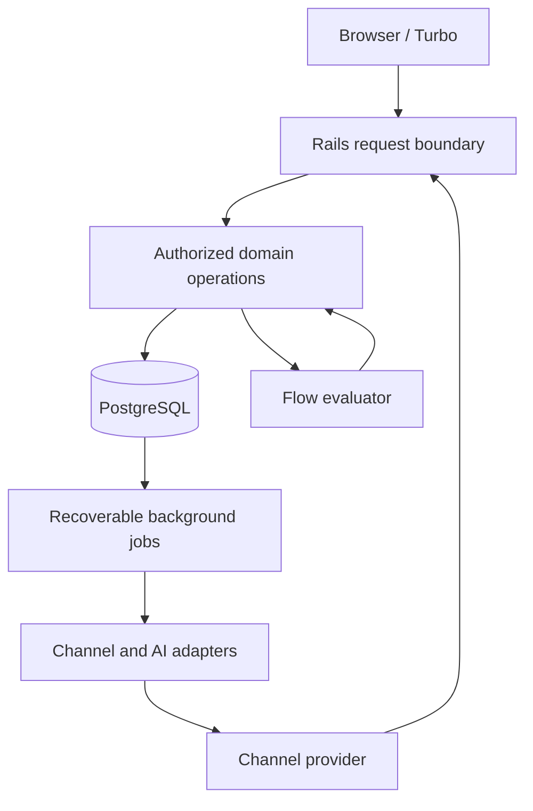

# Reservi Architecture

## 1. Status and objective

Target architecture, specified 2026-09-11; application code does not yet exist at baseline `153315d`. See [gap-audit.md](gap-audit.md) and [implementation-plan.md](implementation-plan.md) for missing implementation and proof.

Build a compact Rails monolith which turns Conversations into configured outcomes. Preserve ADR-001: Conversation is the process instance; Stage is work plus a gate; Catalog/Item is universal selection; Appointment is independent scheduling state. A one-stage Flow may finish without either a Catalog or an Appointment.

The product exposes one shared workspace to human and AI Agents. PostgreSQL owns durable state. Rails owns validation, authorization, predicates, and rendering. No separate SPA, microservices, event sourcing, generic command bus, or arbitrary workflow scripting.

## 2. System boundaries

The evaluator/domain cycle is bounded local orchestration, never recursive callbacks. Workers run the same release as web processes. Adapters make network calls outside database transactions.

| Boundary | Owns | Must not own |
|---|---|---|
| Controllers | Authentication, Account resolution, input parsing, policy checks, response | Hidden transitions or provider protocol logic |
| Models / focused operations | Invariants, transactions, local mutation, history | Slow network requests |
| Flow evaluator | Read typed state, evaluate rules/gates, record progression | Feature-specific service/car/property branches |
| Policies | Account membership, team visibility, actor capabilities | Trust in submitted tenant/actor IDs |
| Jobs / adapters | Durable delivery, retries, reconciliation, AI inference | A parallel business state machine |
| Views / Turbo | Render permitted state and evaluator explanations | Independent completion or authorization logic |
| Stimulus | Selection widgets, local interaction and focus | Authoritative state or optimistic irreversible success |

## 3. Technology and organization

Use Rails, PostgreSQL, Turbo, Stimulus, Active Job, Active Storage, and Rails' default testing conventions. Select supported versions during T01 and pin them in runtime/lock files; this document does not pretend a Gemfile exists. Prefer a database-backed Active Job adapter; the durable recovery mechanisms below must work even if the queue uses a separate database.

Create only folders with real code. Use normal Rails controllers/models/views/jobs and model namespaces such as `Conversations::Assign` or `Flows::Evaluate` for substantial multi-record operations. Keep pure typed expression/state-reader objects under a small `Flows` namespace. Provider clients belong under `integrations`. Policies belong under `policies`. Do not build a repository, DTO, event bus, or universal action framework around Active Record.

## 4. Authoritative state

| Fact | Writable source |
|---|---|
| Request lifecycle, current stage and owner/team | Conversation |
| Published process definition | Immutable FlowVersion and its Stages |
| Customer identity/profile | Customer and ChannelIdentity |
| Request custom answers | Conversation validated custom values |
| Reusable listing | Catalog / Item |
| Chosen listing context | ItemSelection and selection snapshots |
| Scheduled commitment | Appointment |
| Customer-visible delivery | Message |
| Internal collaboration | Note |
| Past transition / assignment / action | Append-only domain history / RuleExecution |

Inbox status is not a second sales pipeline. Process status, per-agent read position, attention, and Appointment status have distinct meanings. Detailed lifecycles and relational constraints are in [domain-model.md](domain-model.md).

## 5. Tenant and actor boundary

A User may have several Account memberships. Each human Agent belongs to one Account and references that membership; an AI Agent has no fabricated User. Teams and their memberships stay inside an Account. Agencies access client Accounts through explicit memberships and switch Account context. Teams may represent locations, but do not create cross-tenant visibility. No cross-account calendar conflict guarantee in the pilot.

Every account-owned relational record has `account_id`. Use composite foreign keys `(account_id, parent_id)` against unique `(account_id, id)` targets for tenant-sensitive associations. Application scoping alone is insufficient. JSON references cannot have ordinary foreign keys: validate their types, Account ownership, and existence at publication and again at execution; retain referenced published configuration.

Every operation accepts a server-created actor context: Account, human/AI/system origin, applicable Agent, capability set, correlation/operation ID. A system rule runs under an explicit Account automation capability policy, with RuleExecution attribution; it is not a superuser or a fake human. Never use the rule author's old session as its authority.

| Role | Default scope and capability |
|---|---|
| Account administrator | Account configuration, memberships, all operational records |
| Team manager | Operational records and assignment in managed teams; no global configuration editing |
| Operator | Own conversations and authorized team queues; claim/reply/edit/schedule within granted capabilities |
| AI Agent | Assigned conversations only; explicit allowed tools and fields; no membership/configuration editing |
| Rule execution | Current conversation, allowlisted actions under Account automation policy |

Team visibility does not grant all mutations. Reads, assignment, messages, custom fields, selectors, appointments, and configuration are independently authorized. Blocks guide work; they are not an authorization mechanism. Past-stage data remains correctable through authorized detail controls. Current-stage required work does not forbid independent appointment creation elsewhere in the workspace.

Recheck membership/capabilities in jobs and immediately before applying AI output. Revocation disables access, invalidates realtime subscriptions, stops future AI actions and requeues owned work visibly. Preserve historical actor references by deactivation rather than destructive deletion. Realtime rendering must use the permitted projection for each audience; do not broadcast admin-only content to every team member.

## 6. Configuration lifecycle

Flow is stable identity; FlowVersion is a draft or immutable published definition. Stages belong to a version. A Conversation pins a published version at creation. Publication validates the entire definition atomically, then switches the Flow's current published pointer. Existing Conversations never move implicitly.

Stage blocks/rules/completion use validated JSON with stable keys, not arbitrary code. Published definitions and referenced field types cannot be destructively changed. Labels in a published version remain historical; changes appear in a new version. Catalog listings remain live, but selected context uses snapshots. Removing an Agent or archiving a Catalog can make an action unavailable; surface a blocked reason, never silently skip it. Restore the target only if operationally appropriate. If it must remain unavailable, an administrator can cancel the blocked request and start a linked request on a corrected published version, reviewing the prospective actions and explicitly carrying any still-valid request facts/selections. Old messages, actions and appointments stay on the original request; no automatic copy/replay or hidden migration. The UI must explain this escape path.

Do not build automatic migration, graph branching, or reverse progression in the pilot. Full execution contracts are in [flow-engine.md](flow-engine.md).

## 7. Mutation and evaluation transaction

A request follows this path:

1. Resolve Account and actor; scope record; validate expected revision and inputs.
2. In a short transaction lock Customer first, then Conversation. This makes customer facts and request state a coherent evaluator snapshot. Before mutation, acquire the complete additional target lock set described in domain-model §32; sorting separately inside each action is insufficient because outer transactions retain earlier locks. No callback may acquire them backwards.
3. Recheck authority and relevant constraints under the lock. Apply local mutation and domain history. Increase Conversation state revision only for meaningful changes and leave evaluation pending.
4. Run the bounded evaluator synchronously for small local work or let a worker evaluate the latest revision. Both use the same entry point. Never evaluate against pre-mutation caches.
5. Commit local state, rule execution guards, history, and external delivery intents together. Render committed state, including pending/blocked automation where relevant.
6. Wake workers after commit. Recovery sweeps find persisted pending work if enqueue was lost.

Customer updates lock Customer and change its profile revision plus a durable fan-out-needed marker. A fan-out job marks active conversations pending in bounded batches, records its progress, and can be retried. Evaluators lock Customer then Conversation and record which profile revision was read. Thus a field shared by several requests is not silently stale. Completed/cancelled flows are never re-advanced by fan-out.

Use optimistic expected revisions to reject stale browser or AI writes. An evaluator coalesces requests and evaluates latest state; it does not replay a stale snapshot. User data updates can commit while automation is blocked; show the error and retain pending work for explicit retry after repair. Do not roll back a valid user correction solely because a rule target was deactivated.

## 8. Rules and external delivery

Rules run once per current stage entry in stable priority/key order. Local actions in one rule form an atomic bundle. The execution guard and actions commit together; failure rolls back that bundle and records an actionable automation error separately. Previously committed rules are not undone. A later retry skips successful executions and retries the failed bundle against current state and permissions.

Sending a message means creating a durable local Message intent, not performing a network call during evaluation. “Accepted locally”, “sent”, “delivered”, and “unknown” are different states. Flow completion may proceed after local intent creation; the initial predicate vocabulary does not pretend remote success is atomic with stage advancement.

Persist action identity derived from Conversation, pinned version, stage entry, rule key, and action index. Repeated evaluation cannot produce a new Message for that identity. No generic outbox table is needed merely for Messages: pending Message rows are already durable outbound work. Webhook receipts and AI runs similarly have explicit lifecycles.

The queue gives wakeups, not truth. Periodic bounded recovery sweeps repair lost enqueue and expired worker leases. Retry with bounded exponential backoff and jitter; distinguish permanent, retryable, rate-limited, and unknown-result failures. Expose exhausted work to administrators; do not discard it.

## 9. Messaging and conversation resolution

Webhook processing: verify provider signature using trusted Channel configuration, enforce body limits, persist a uniquely identified receipt, then acknowledge. A worker normalizes the payload, resolves account-scoped ChannelIdentity/Customer/thread, inserts one inbound Message, and updates attention. Receipt completion and domain writes commit together. Deduplication IDs are scoped to Channel/provider, not globally guessed.

Maintain one intake Conversation per Channel/provider thread according to the resolution contract in the domain model. A completed process receiving a new message becomes visible for attention; it does not rerun completed Rules. Starting a new request is an explicit operation. Cross-channel or simultaneous same-thread request disambiguation is not inferred by AI in the pilot.

Outbound workers claim pending Messages with a lease/attempt token, call the provider outside locks, then reconcile using that attempt. A timeout after the provider may have accepted the message produces `unknown`; reconcile by remote ID/idempotency key if supported. Without provider support, require an operator decision before resend. Exactly-once delivery across a remote boundary is not promised.

Application message templates are plain text with allowlisted `{{customer.name}}` or `{{field.conversation.city}}`-style substitutions resolved through the same typed, permitted state reader. No expressions, loops, includes, raw HTML or executable helpers. Publication validates variables and size; execution rejects missing required or unauthorized values, stores the fully rendered body in the Message intent, and retries never render a new body. Escape content when rendered in HTML; customer input remains data. Provider-approved template identifiers and parameters use adapter validation separately.

Adapters own channel send eligibility, template/window requirements, rate limits, media behavior, signature verification, and status ordering. Check the selected provider's current official contract when implementing it. Status callbacks must not regress a delivered/read Message to sent. Retain operational failure metadata without logging credentials or full unnecessary customer content.

Notes are separate from Messages and have no outbound transport. Attachments require size/type checks, account authorization on access, and safe rendering. Credentials stay encrypted in runtime storage; never in Flow JSON, prompts, fixtures, or logs.

## 10. Catalog selection

Catalogs define typed additional attributes. Items have title, description, images, nullable decimal price, currency and price-unit label, attributes, and archive state. Names such as Cars/Services are data only.

Selector updates replace the selected set atomically under Conversation lock, validate cardinality and Catalog/Account membership, and preserve selection-change history. Snapshot the selected title, price/currency/unit, and predicate-relevant typed attributes. Predicates read these selection snapshots so a listing edit cannot reroute an old request. Current listing details can be shown separately. Explicit reselection/refresh validates and records the change.

Archive prevents new selections while retaining existing selected context. Published field/attribute types referenced in snapshots cannot be silently reinterpreted. No Item inventory, capacity, holds, reservation engine, or bookable flag is implemented.

## 11. Appointments

An Appointment belongs to Conversation and a stable role. It needs no Item. Pilot supports one optional scheduled Agent plus Customer context. Conversation owner and scheduled Agent are different facts; reassignment does not silently reschedule.

Store UTC instants, IANA scheduling timezone, positive interval, status, and optional buffer snapshots. Confirmed appointments with a scheduled Agent block that Agent's interval within the Account. Use a PostgreSQL exclusion constraint for overlapping half-open blocked ranges, scoped by Account and Agent and confirmed status. Agent-free appointments do not claim exclusive capacity. See the domain model for lifecycle and constraint details.

Working hours and dated exceptions belong to the scheduled Agent's Account calendar; slot suggestions use those rules but never reserve time. Confirmation revalidates hours/exceptions and atomically checks conflicts. Changes to availability do not cancel existing commitments; highlight affected appointments. Reschedule preserves the old booking if the new interval conflicts.

Calendar reads Appointment truth and selected context from Conversation. Cancelling an appointment after a Flow completed does not erase the historical completion. The operator sees the cancellation and can start follow-up work explicitly.

## 12. AI execution

AI reads a bounded, permitted snapshot: stage/version, relevant message window, structured facts, missing-requirement explanation, selected context, ownership, state/profile revisions, and allowed actions. The model returns typed proposals; it never writes records directly.

AiRun records triggering message/revision, owner, status, model usage, timeout and retry metadata. Only one active run per Conversation. New human ownership or changed input makes old output stale. Handoff atomically invalidates the active run and cancels its pending unclaimed Message intents; sending workers recheck the AI run/ownership token and its configuration, guidance, knowledge and access generations at claim. Any revoked/stale unclaimed AI reply is rejected immediately, even before asynchronous cancellation completes. A provider call already in flight may still complete and must be reconciled visibly. Before each tool mutation, recheck actor, current owner, capability, expected revisions, and action idempotency. After mutation, refresh context before the next action. Do not keep locks during inference.

Bound turns, tokens/cost, wall time, and tool calls. A failed or exhausted run hands off visibly to a human queue. Model instructions and incoming content cannot enable tools, change Account, or bypass validation. Deterministic product tests use a fake adapter; model-quality evaluations are a separate concern.

## 13. UI, performance and operations

Server-rendered inbox and Conversation workspace show current stage, owner, messages/notes, stage controls, missing requirements, appointments, selected items, pending work and errors. Show a logical explanation tree for any/not conditions; do not invent a misleading percentage. Turbo is best-effort freshness: refresh must restore correctness, and stale responses cannot overwrite newer revisions.

Paginate messages/items/inbox with stable cursors; preload bounded stage state; index Account/team/owner/activity, current stage, role keys, provider IDs and pending work. Use database search first. Never load every message/item into an AI prompt or browser.

Deploy one Rails codebase as web and worker processes plus PostgreSQL and object storage. Separate interactive messaging/evaluation queues from slow AI work with worker concurrency limits. Monitor pending age, failures, provider unknown results, AI usage, evaluation latency, database contention and authorization failures. Correlate Account/Conversation/job/operation IDs; redact secrets and unnecessary personal content.

Back up database and media; perform an actual restore before pilot. Use additive migrations and rolling-compatible changes; take backups before destructive migrations. Document rollback of code separately from data repair. Release gates and provisional performance targets are in the implementation plan. Provider selection, hosting size and retention policy must be recorded before production; they are not silently assumed.

## 14. Architectural checks

A new feature must justify its state, controls, predicates and actions. A fact is a Field; a reusable selectable thing is an Item; a timed commitment is an Appointment. Anything else must demonstrate an independent invariant. Keep one domain operation path for humans, AI and Rules, one predicate interpreter, one current stage and owner, and one scheduling truth.

## 15. Account setup and AI knowledge boundary

[Accounts and AI setup](accounts-and-ai-setup.md) defines the administration experience and concrete contracts. A global User creates multiple Accounts and becomes administrator through each Account's Membership; account creation is idempotent. Invitations grant membership only after matching verified-email acceptance and current authority checks. Pending invitations do not create assignable human actors. Last-administrator protection and one Human/AI roster extend the existing Agent model.

Account administration is distinct from platform administration. Per-tab Account routes, scoped subscriptions, pagination and resumable onboarding keep many Accounts manageable. Default General Team, responsibility presets, shared Knowledge and private previews reduce repeated setup. Humans can operate before autonomous AI is configured.

AI behavior is versioned in AgentConfiguration, while KnowledgeSource/Revision owns authored or extracted material and publication. Q&A, documents and scenarios share this lifecycle; restricted sources require explicit Agent grants. PostgreSQL initially provides scoped retrieval; published revisions and permission filters are applied before ranking. Documents are untrusted reference material, never additional tool authority.

AI context combines canonical Stage explanations/domain state, current published behavior, permitted retrieved snippets and bounded dialogue. AiRun records configuration/source versions and invalidation generations as well as owner/input revisions. Publishing behavior, archiving a source or revoking a grant makes affected pending work stale before another action/send claim. Agent activation uses the same assignment path; admission, budgets, pause and fallback are defined in the setup contract. AI-related runtime transactions acquire Account control before Agent locks; Account control mutations enqueue Conversation recovery separately and never invert that order. If a human fallback becomes unavailable, an administrator-visible attention queue retains the work. Model inference and document extraction remain background work outside database locks.

The human workspace and AI adapter share the `AgentWorkspace` read contract and existing domain operations. Work, Knowledge and Guidance are common areas: humans browse/read Q&A, documents, scenarios and instructions inside the Conversation; AI uses the same scoped sources and state through structured tools. AgentKnowledgeGrant supports both Agent kinds. Profile configuration is AgentConfiguration for both, with AI-only runtime fields disclosed only where relevant. Human Knowledge use does not depend on AI activation. Handoff never transfers the previous owner's private source grants or cached excerpts. See setup §11 for shared UI and parity acceptance.
