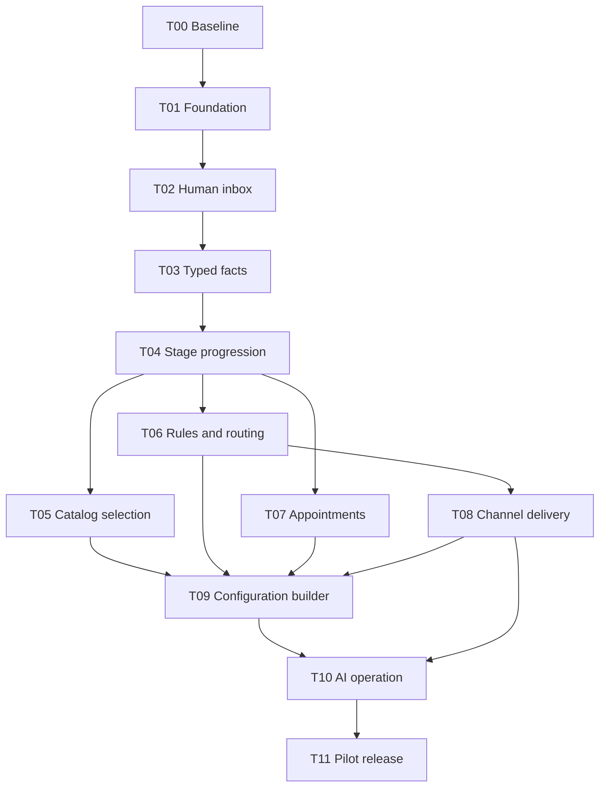

# Reservi implementation plan

Status: planning complete; implementation not started. Baseline: `153315d`, specifications only. No task below is marked done because documentation exists.

## 1. Delivery strategy

Build vertical slices through Rails, PostgreSQL, policies, rendered UI and meaningful tests. First prove a human can complete a configured request. Then add deterministic automation, appointments, a real channel, and finally AI using those same operations. Do not start with a universal engine, a full visual builder, or an autonomous chatbot.

Use [gap-audit.md](gap-audit.md) to trace why a task exists. Required invariants are in [invariants.md](invariants.md). Architecture/domain/runtime documents define decisions; this file defines work order and evidence. Dependencies refer to **verified** completion, not code merely being written.

## 2. Dependency graph

T05/T06/T07 have independent feature scopes once T04's interfaces stabilize; parallel work is optional and must not produce conflicting schema/operation conventions. A single engineer can implement sequentially. Each task should be split into small commits while preserving its end-to-end acceptance gate.

## 3. Task board

| Task | Dependencies | Status | Visible deliverable |
|---|---|---|---|
| T00 | None | TODO | Checked baseline and reproducible scope |
| T01 | T00 | TODO | Bootable, secured multi-account Rails application |
| T02 | T01 | TODO | Human inbox, messages, internal notes, ownership and attention |
| T03 | T02 | TODO | Typed customer/request data and correction UI |
| T04 | T03 | TODO | Published sequential flow that actually progresses |
| T05 | T04 | TODO | Universal Catalog/Item selection with stable context |
| T06 | T04 | TODO | Explainable, retry-safe Rules and routing |
| T07 | T04 | TODO | Independent appointment/calendar workflow |
| T08 | T06 | TODO | One reliable external messaging channel |
| T09 | T05, T06, T07, T08 | TODO | Safe administrator Flow builder and preview |
| T10 | T09, T08 | TODO | Bounded AI Agent using the same operational tools |
| T11 | T10 and all prior gates | TODO | Restorable, measured, observable pilot release |

Allowed status: TODO, IN_PROGRESS, BLOCKED, VERIFIED. A BLOCKED task records exact blocker, attempted action and next step. VERIFIED requires a commit, commands/results, and evidence link in the ledger below. Never infer completion from this plan.

## 4. Task contracts

### T00 — Baseline and scope

Read current branch, AGENTS.md, ADRs and canonical documents. Verify no application has since appeared. Record runtime and deployment constraints that actually exist. Reconcile newer user requirements before scaffolding. Preserve OpenCode files.

Acceptance: document baseline SHA and clean/dirty status; identify target Ruby/Rails/PostgreSQL versions to verify at T01; retain the exclusions below. No claim of existing tests, production behavior or migration source without evidence.

### T01 — Foundation, tenancy and authorization

Create Rails monolith with PostgreSQL, Hotwire, Active Job and Active Storage. Pin supported runtime/dependency versions after checking current official compatibility. Add reproducible setup, test, worker and development commands to root README. Add CI boot/migration/test/lint/security checks that actually run. Start with Account/User/Membership/Agent/Team schema, policies and shared actor context.

Acceptance:

- Clean checkout can install, create/migrate database, start web/worker and run a smoke test.
- User belongs to two Accounts and switches explicitly; membership in one does not grant access to the other.
- Account-scoped composite foreign keys reject mismatched associations through direct database writes.
- Role/capability denial is tested at request and operation boundaries, including inactive memberships and AI identity without User.
- Login/logout/CSRF/session behavior works on phone viewport; no fixture credentials in production config.

Proof: setup on clean database, authentication requests, direct integrity tests, minimal browser smoke, CI run. High-risk invariants: INV-001–004, 080–082.

### T02 — Human conversation workspace

Deliver Customer/Conversation, local channel-thread identity where needed, Message/Note, ownership history, per-Agent read cursor and shared attention. Use manually created conversations and a deterministic development channel until T08. Include the minimal Flow/FlowVersion/Stage schema and a seed-created immutable published one-stage definition with a `literal=false` gate, so every active Conversation already satisfies the pinned-version invariant. T02 supports cancellation but not terminal completion. T04 extends this small baseline with the full interpreter, publication UI/validation and automatic progression; do not build a second temporary lifecycle.

Acceptance:

- Operator sees own/authorized team work, can claim an unowned request once, read, reply locally and add a private note.
- Team manager cannot browse another unauthorized team's conversations in the same Account.
- Conversation cancellation and attention are separate; a new message raises attention without erasing cancellation. Terminal completion is delivered and tested in T04.
- Two stale edits cannot silently overwrite; requests return current state and preserve user input on conflict.
- Notes cannot enter the send path; attachment and Turbo access respect the permitted audience.
- Inbox and message list paginate stably and retain authoritative state after refresh.

Proof: request/policy tests, concurrency claim test, mobile end-to-end note/reply/refresh test. INV-010, 016, 060–065, 100–104.

### T03 — Typed facts and shared profile updates

Implement FieldDefinition with built-in bindings and typed JSON custom values. Deliver a small edit form with clear validation errors, field-level permissions, expected revisions, history and Customer revision/fan-out marker. Customer updates must not expose other conversations.

Acceptance:

- `false` and `0` persist as real answers; invalid choices/types and reserved-key collisions fail.
- A customer name edit writes the canonical Customer column, not a parallel custom value.
- Request budget edits affect only that request; shared profile change leaves durable reevaluation work for all active requests.
- Revoked capability and foreign-account FieldDefinition are rejected through the same operation used by future AI.
- Definition type changes after use are rejected; an explicit new key is required.

Proof: type/validation matrix, permission requests, shared-update crash/fan-out test. INV-030–034, 090.

### T04 — Flow publication and deterministic progression

Extend the minimal Flow/FlowVersion/Stage baseline with full draft validation and publication operation, typed predicate interpreter and explanations, evaluator, stage history, pending revision recovery. Use seed/configuration fixtures or a minimal admin form before the full T09 builder. Reject configured action types until their handler is delivered.

Acceptance:

- One-stage field-only Flow completes without Catalog or Appointment; explicit `literal=true` supports intentional immediate completion.
- All/any/not use specified missing-value semantics and show the same explanation in rendered UI and serialized context.
- Published version is immutable; existing Conversation stays pinned when a new version becomes current.
- Concurrent completion writes one transition; state mutation/transition/history commit together.
- Crash after state commit and before enqueue is repaired by a sweep; shared Customer revision update reaches all active requests.
- Corrections reevaluate only current stage; completed/cancelled flow does not reopen or rewind.
- Budget continuation progresses safely across more than ten ready stages without recursion or data loss.

Proof: predicate matrix, direct constraints, concurrency and crash tests, mobile field-only progression. INV-011–015, 020, 023–025, 090–091.

### T05 — Catalog and selectors

Implement Catalog attributes, Items/media, archive, pricing, selector operations and snapshots. Add Catalog selector block, permitted predicates and normal action handlers. Provide simple admin Catalog CRUD and operator single/multi picker.

Acceptance:

- Services, Cars and Properties use the identical model/controller/selector path.
- Selection-only flow completes with no Appointment.
- Concurrent replacement maintains cardinality; duplicate/foreign/archive additions fail.
- Listing price/attribute edits leave selected context and predicate results stable; explicit refresh is audited.
- Null versus zero price and currency/unit comparison are correct.
- Selected archived Item remains understandable; media cannot leak Accounts.

Proof: generic fixtures, snapshot/integrity tests, race test, mobile picker/refresh. INV-040–046, 051–052.

### T06 — Rules, assignment and execution history

Deliver RuleExecution, actor policy, atomic local action bundles, stable execution keys, priority ordering, bounded reevaluation and visible retry/error controls. Implement assignment to eligible Agent or Team queue using the same operation as manual work. Send-message action remains unavailable until T08 delivers its full intent/reconciliation path.

Acceptance:

- City=Marrakech assigns the configured eligible Agent and explains why.
- True→false→true and duplicate evaluator jobs do not repeat a successful rule.
- Human reassignment survives reevaluation of already fired rules.
- Team change clears an ineligible owner; no eligible Agent leaves visible queued work.
- Later rule enabling an earlier predicate triggers a new ordered pass; competing assignments follow declared order.
- A failing action rolls back its whole local bundle, pauses progression, and supports explicit safe retry; a now-false failed predicate no longer blocks.
- Membership/automation capability revocation takes effect on execution, not merely at publish time.
- Validate that execution computes its complete target lock set before invoking handlers; the combined scheduling/selection concurrency proof is delivered at T09 after T05–T07.

Proof: ordering/failure matrix, concurrency execution identity test, manual-versus-rule parity, browser history/error flow. INV-021–024, 060–065.

### T07 — Independent appointments and Agent calendars

Deliver Appointment lifecycle, current role uniqueness, optional scheduled Agent, UTC/IANA conversion, weekly hours/dated exceptions, bounded slot queries and calendar UI. Add Appointment block/predicates/actions; duration comes from input/block configuration. Do not model Item capacity.

Acceptance:

- Appointment-only flow completes without any Catalog; a field-only Flow can also create an independent workspace Appointment with an ad hoc role.
- Both Item→Appointment and Appointment→Item flow orders work when T05 is available; multiple independent roles work.
- Two concurrent confirmations for the same Agent/interval cannot both commit; adjacent half-open intervals may coexist.
- Failed reschedule keeps original confirmation; cancellation releases interval; replacement preserves old role history.
- DST ambiguous/nonexistent times have explicit UX, and different display zones refer to the same instants.
- Calendar and Conversation use the same record, with current selected context clearly labeled.
- Cancellation after Flow completion remains visible without automatic rewind.

Proof: PostgreSQL exclusion constraint via concurrent/direct writes, lifecycle tests, timezone fixtures, mobile schedule/reschedule/cancel. INV-050–056.

### T08 — Reliable channel ingestion and sending

Choose one provider explicitly; verify current official signature, identity, template/send-window, idempotency, status and rate-limit contracts. Implement adapter against fake contract fixtures first, then controlled integration credentials. Add durable receipt-before-ack ingestion, identity/thread resolution, Message intents, leases, recovery sweeps, status reconciliation and error UI. Enable Rule send action only now.

Acceptance:

- Concurrent duplicate inbound events create one Message and one intake request; receipt survives worker interruption.
- Completed-flow inbound raises attention without rerunning rules; explicit new request switches intake pointer atomically.
- One rule action produces one local outbound intent despite retries.
- Provider accepted request followed by timeout becomes unknown; no unsupported blind resend.
- Reordered delivery callbacks cannot regress known delivery; deactivated Channel stops new sends visibly.
- Worker crash before/after remote call follows distinct safe recovery paths; failed handoff cannot misroute transport identity.
- Operator sees pending, sent, failed and unknown states and can recover with context.
- Message templates accept only the documented substitutions; unknown/private/missing required fields fail safely, hostile content remains escaped data, and retry retains the same rendered body.

Proof: deterministic adapter contract tests and injected failure matrix, then controlled real receive/send/status smoke with evidence and no unintended recipients. INV-003, 070–073, 090–093.

### T09 — Safe administrator builder

Deliver ordered Stage editor, field/catalog/appointment blocks, Rule/action forms, completion editor, validation reports, pure preview and publish. Registry reflects only implemented controls/predicates/actions. Default template is editable and not a mandatory business sequence.

Acceptance:

- Admin creates and previews field-only, catalog-only, appointment-only, appointment-first and catalog-first versions.
- Preview never writes state, sends messages or schedules jobs.
- Cross-customer Rules scheduling Agents A/B in reversed action order and interleaving Item selections obey the complete pre-acquired lock protocol; prove this integration only now that T05–T07 handlers exist.
- Unsupported operators/actions, excessive AST, cross-account targets and inconsistent roles fail publish with exact locations.
- An inaccessible future-only requirement is identified rather than publishing an accidental dead end.
- Publishing does not change an in-flight Conversation; draft changes do not execute.
- Archived/deactivated targets produce understandable validation/runtime remediation. A permanently invalid pinned target offers the explicit cancel-and-start-linked-request path on a corrected version, with a preview of new actions and no silent replay/copy.

Proof: publication tests, safe-preview side-effect assertions, composition browser suite at phone and desktop sizes. INV-004, 015, 025, 033, 101–103.

### T10 — AI as a bounded operational Agent

Deliver AiRun, fake/live adapters, permitted snapshot and tool schemas. Use normal domain operations and pending Message intent flow. Implement budgets, leases, stale revision/ownership rejection, explicit handoff and administrator disable controls.

Acceptance:

- AI and human read the same missing requirements and edit the same facts/selections/appointments.
- A malicious incoming message cannot add tools, target another Account or modify configuration.
- Human handoff/reassignment makes old AI output unusable; one active run per Conversation survives duplicate triggers.
- Invalid tool call, provider outage, budget limit or expired lease produces visible failure/handoff without corrupting state.
- Each subsequent tool action refreshes revision after the prior write; duplicate tool IDs do not repeat effects.
- Pending AI replies invalidated before send claim are cancelled on handoff; already in-flight provider calls have visible reconciliation rather than a false cancellation guarantee.

Proof: deterministic fake model and concurrency tests; separate small consented live quality evaluation for extraction, escalation and tool choice. INV-063–065, 090–091.

### T11 — Pilot readiness and operations

Finish deployment/runbook, backup/restore, queue recovery, monitoring, restricted media, mobile/RTL/accessibility and bounded performance checks. Record selected provider, runtime versions, hosting and data retention/deletion decisions. Do not call the app production-ready solely because CI passes.

Provisional pilot workload, to revise with real evidence: 20 Accounts, 50 active Agents in the busiest Account, 100,000 Conversations total and 1,000,000 Messages total; 20 concurrently active browser sessions. Seed realistic skew rather than evenly tiny tenants. Under that workload target p95 server response <500 ms for bounded inbox/detail/local mutations, p95 normal evaluation backlog <5 seconds, and webhook durable acknowledgment <2 seconds or the provider's stricter requirement. These are acceptance targets, not measured claims or universal scale promises.

Acceptance:

- Complete cross-tenant and same-account restricted-team regression suite; independent review has no unresolved critical/high correctness defects.
- Restore database and media into a clean environment and verify a conversation, selection, attachment and appointment. Adopt provisional RPO <=24h and RTO <=4h only if the pilot operator accepts them and the exercise proves them; otherwise improve the plan before release.
- Kill/restart workers and show pending ingestion/evaluation/delivery recovery without duplicate irreversible effects.
- Run mobile core journeys at 360px and desktop, keyboard focus/error feedback, and French/Arabic text including RTL layout.
- Load results identify hardware, dataset, timings, query counts and bottlenecks; no claim beyond tested envelope.
- Monitor provider unknown outcomes, oldest pending work, failed rules, AI spend and DB contention; verify alert and recovery procedures.
- Rehearse deployment and compatible rollback; record data-repair procedure for migrations that cannot be reversed safely.

Proof: CI result, independent diff review, browser evidence, crash exercise, restore report and measured load report.

## 5. Deliberately deferred

Item availability/query/manipulation, inventory holds, payments, quotes, invoices, generic webhooks/actions, workflow graphs/loops/timers, parallel stages, multi-participant scheduling, recurring/all-day appointments, automatic version migration, cross-account calendar conflicts, inferred identity merging and simultaneous independent requests in one provider thread are outside this pilot. They may integrate later, but no speculative tables or APIs are needed now.

## 6. Evidence ledger

Append one row per verified task; keep TODO tasks out of the verified ledger. If proof fails, keep the task IN_PROGRESS/BLOCKED and record the failing command plus repair.

| Task | Commit | Actual checks and results | Evidence / remaining limitation |
|---|---|---|---|
| None | — | No runtime checks exist at documentation baseline | Implementation not started |

## 7. Working agreement for an implementation agent

Read relevant docs/skills, pick the earliest unblocked task, inspect actual code, and declare affected invariants. Implement only its coherent vertical slice. Run meaningful focused checks; use concurrency/failure/browser checks for the risks named above. Review the complete diff independently as AGENTS.md requires. Update task status and evidence only after verification. Report concrete blockers instead of inventing credentials, provider guarantees, passing tests or production behavior.
